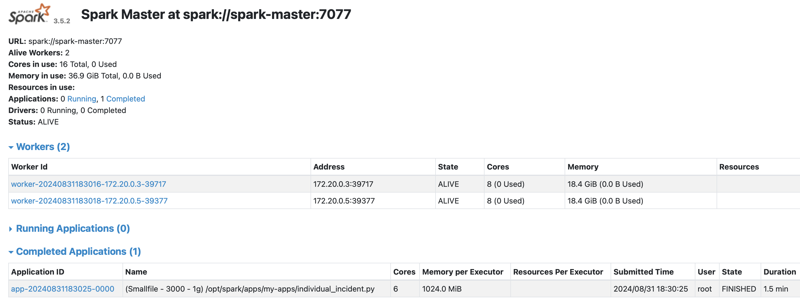
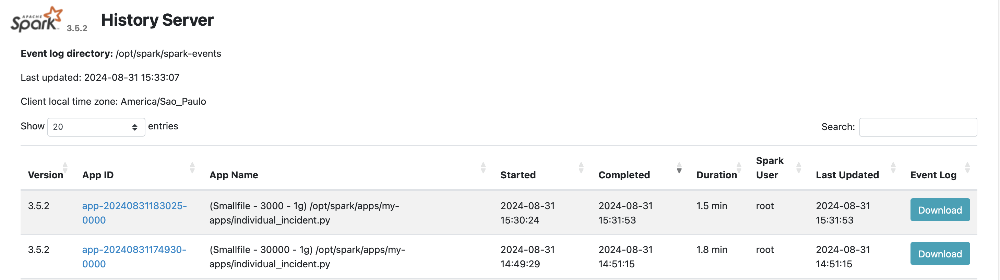

# Spark Lab

Este repositório fornece um ambiente `Spark 3.5.7` com suporte a `Delta Lake 3.3.2` para experimentação.

----

## Objetivo

O objetivo deste repositório é fornecer os arquivos para o desenvolvedor executar experimentos em um cluster `Spark 3.5.7`, em modo client, simulado a partir do Docker, com suporte ao Delta Lake 3.3.2. Com isso, o desenvolvedor pode experimentar diversas configurações para a sessão de sua aplicação (`SparkSession`) sem se preocupar com custos de uso de cloud, limitado apenas às condições do seu equipamento.

----

## O que não esperar?

O objetivo deste repositório **não** é apresentar um projeto de produto de dados. Portanto, não trataremos de integrações, transformações ou enriquecimento de dados a fim de suprir uma necessidade de negócio específica.

----

## Sistema de referência

Este projeto foi testado em um hardware de prateleira com as seguintes configurações:

- Processador Intel i5 de 8a geração.
- 20GB de RAM
- Sistema Operacional Debian 11.

É recomendado o uso de sistemas operacionais GNU/Linux, porém nada impede do usuário realizar as adaptações deste projeto para o seu sistema operacional de preferência.

----

## Software necessários

- [Docker Engine](https://docs.docker.com/engine/install/)
- [Docker Compose](https://docs.docker.com/compose/)
- [Task](https://taskfile.dev/) - Executor de tarefas (alternativa ao Make)

## Como iniciar o cluster pela primeira vez?

Para iniciar o cluster pela primeira vez, execute os seguintes comandos:

```sh
task image-build
task rund
```

Caso o usuário deseje criar um cluster com mais de um nó trabalhador, basta especificar o parâmetro `spark-worker`. Por exemplo, para criar um cluster com 3 nós trabalhadores:

```sh
task image-build
task rund spark-worker=3
```

----

## Como executar uma aplicação Spark?

Para executar uma aplicação Spark utilizando este projeto, é necessário colocar o diretório contendo os arquivos da aplicação no subdiretório `spark-apps`. Em seguida, basta executar o seguinte comando:

```sh
task submit APP=caminho/relativo/a/spark-apps/app.py
```

Por exemplo, para executar a aplicação `my-apps/individual_incident.py`, executamos o seguinte comando:

```sh
task submit APP=my-apps/individual_incident.py
```

----

### Exemplos com Delta Lake

Este projeto inclui aplicações de exemplo com Delta Lake:

```sh
task submit APP=my-apps/clean/individual_incident_delta_liquid_clustering.py
task submit APP=my-apps/clean/individual_incident_delta_zorder.py
task submit APP=delta-lake-test/delta_test.py
```
----

## Como monitorar a execução da minha aplicação?

Para monitorar a execução da sua aplicação, basta acessar o `Spark Master UI` pelo seu navegador preferido a partir do endereço`localhost:9090`.



----

## Como avaliar as aplicações já executadas?

Para avaliar aplicações cuja execução já fora finalizada, basta acessar o  `Spark History Server UI` pelo seu navegador preferido a partir do endereço `localhost:18080`.



----

## Como incluir novos datasets?

Para utilizar outros datasets que não foram incluidos aqui, basta criar a estrutura de pastas dentro do subdiretório `data` com os arquivos que serão utilizados.

Por exemplo, neste projeto temos o dataset `data/landing/individual_incident_archive_csv`, composto por 5 arquivos CSVs. A estrutura de pasta emula a camada `landing` de um data lake.

----

## Datasets utilizados

- [National Incident Based Reporting System](https://dasil.grinnell.edu/DataRepository/NIBRS/Individual_Incident_Archive_CSV.zip):
  - Formato: CSV.
  - Tamanho compactado: ~2.1 GB
  - Tamanho descompactado: ~24 GB.

----

## Referências

- [Data Analysis and Social Inquiry Lab](https://dasil.sites.grinnell.edu/downloadable-data/)
- [Setting up a Spark standalone cluster on Docker in layman terms](https://medium.com/@MarinAgli1/setting-up-a-spark-standalone-cluster-on-docker-in-layman-terms-8cbdc9fdd14b)
